**Build 26.242.1533**
#
# Lady Bug
A remake of [Universals 1981 Lady Bug arcade game](https://en.wikipedia.org/wiki/Lady_Bug_(video_game)) written in 6502 assembly language for the [Acorn BBC Micro Computer](https://en.wikipedia.org/wiki/BBC_Micro) systems, assembles with the excellent [BeebAsm](https://github.com/stardot/beebasm) assembler


#
A map editor is now included with the game allowing the player to create/edit/save their own mazes to disk, choose any 3 of the available mazes to be played in game with each maze played for 2 rounds before advancing to the next. Every six rounds the map sequence repeats.\
\
A demo mode has been added and starts if the game is left idle on the main menu for 22 seconds\
The main menu sound option now has 3 settings OFF, ON (Game sounds only), DEMO (Game and Demo sounds).

#
**Tested on the following computer models using emulators**\
\
B OS 1.20 using 12K of sideways ram\
B+ 64K/128K OS 2.00 using 12K of workspace ram ( no sideways ram required )\
Master 128K MOS 3.20/3.50 using 12K of sideways ram\
Master Compact MOS 5.00/5.10 using 12K of sideways ram\
\
Supports the following control input\
Keyboard (All Models)\
Digital User Port Joystick (All Models)\
Analogue Port Joysick (B/B+/Master)

#
**The full game development diary can be viewed at the** [Stardot forums](https://stardot.org.uk/forums/viewtopic.php?f=53&t=21812)
#


```
A big thank you to
 
HeadHunter for recreating the enemy release sound for 50Hz using math !
Kieranhj for their image2mode7 utility allowing me to make the lovebyte loading screen
Dreamland Fantasy's for their image2bbc utility allowing me to make the maze editor tiles
And to everyone at the stardot forums for their kind words, help and support during development.
```
#
_**Note: The video and screenshots are from various builds during development, current build may differ slightly**_
#
[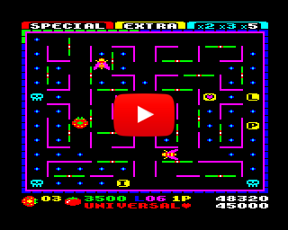](https://www.youtube.com/watch?v=ziSzReRbM00) 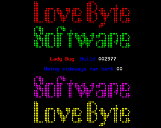 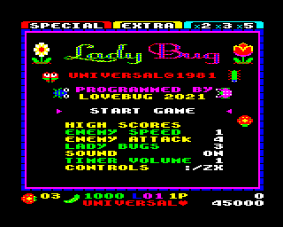 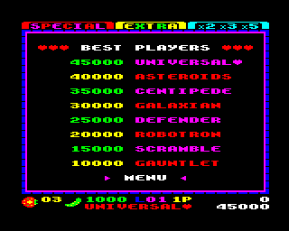 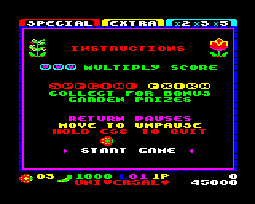 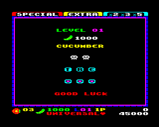 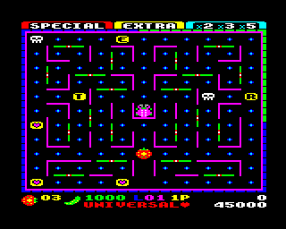 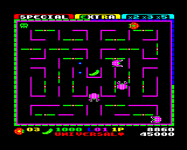 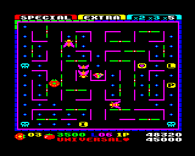 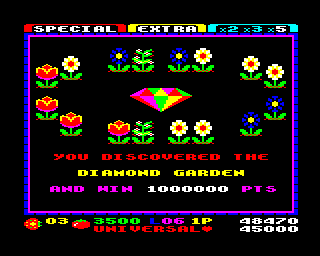 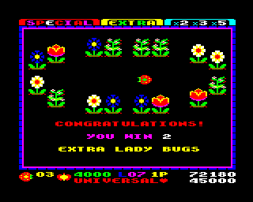 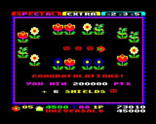 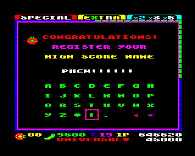


#
**How to build (linux)** requires beebasm\
open terminal in the src directory and type **./build**
